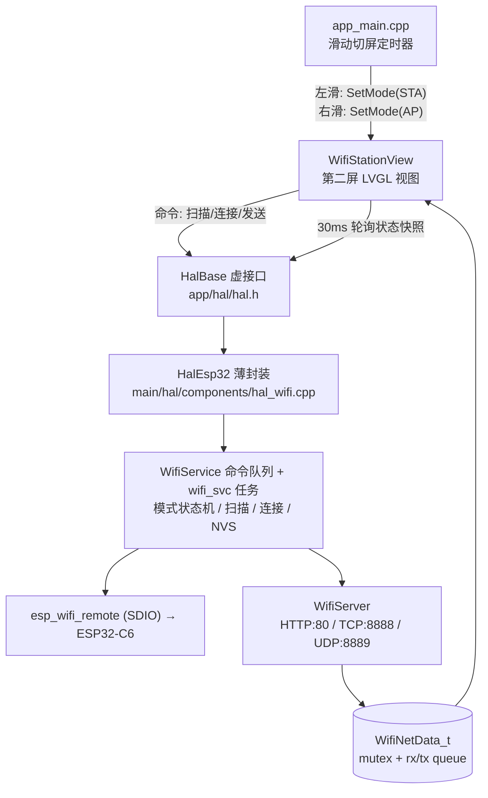

## Product Overview
M5Stack Tab5 用户 Demo（1280x720 触摸屏）的第二屏目前只是一句 "Hello World!"。本次将其升级为「WiFi 配网 + 局域网双向数据收发」工作台：第二屏负责扫描并连接外部路由器（Station 模式），连接成功后在本机起服务端，让同网段 PC 用浏览器和 TCP/UDP 调试工具与设备互发数据；第一屏保持原有的「热点 + 网页」能力不变，两屏通过左右滑动切换，WiFi 工作模式在切屏时互斥切换、不共存。

## Core Features
- **模式互斥切换**：进入第二屏时停掉第一屏的热点与网页服务并切换为 Station 模式（可扫描、可连接外部 WiFi）；右滑回第一屏时断开 Station 并恢复热点与网页。切换过程有明确的进行中/完成提示，避免模式冲突导致功能异常。
- **网络扫描列表**：进入第二屏自动扫描（并提供手动重新扫描按钮），以列表形式展示周围可用网络，每行包含网络名称（SSID）、信号强度（进度条 + 百分比）与是否加密，扫描中显示加载状态。
- **选择网络并连接**：点击列表中的某一行弹出密码输入弹窗，通过屏幕软键盘输入密码（密码以圆点隐藏显示），提供连接与取消；已连接时允许断开重连。
- **连接状态反馈**：全程显示当前状态（待机/扫描中/连接中/已连接/失败/超时），失败时给出原因提示（如密码错误、找不到网络），超时约 15 秒后自动结束并提示；连接成功显示 IP 地址、网关、本机 MAC 与当前信号强度。
- **本地服务端**：连接成功后展示并自动启动服务信息——Web 调试页地址（http://设备IP/）、TCP 服务端口 8888、UDP 服务端口 8889；PC 端既可打开网页查看状态与收发数据，也可用 TCP/UDP 调试工具进行透传收发，设备侧与 PC 侧互为双向。
- **屏内数据监视区**：第二屏内嵌收发记录窗口，实时显示来自 Web/TCP/UDP 的数据并标注来源，支持在屏幕上输入文本、选择 TCP 或 UDP 通道点击发送，并提供清空记录；无客户端连接时给出空状态提示。
- **凭据记忆与自动重连**：连接成功的网络名称与密码被保存，下次开机进入第二屏自动尝试重连；自动重连失败时仍可手动扫描选择，返回第一屏依旧可正常使用热点与网页。
- **视觉呈现**：整屏深色卡片式布局，顶部为标题 + 彩色连接状态徽标 + 返回手势提示；列表选中行高亮，按钮带点击反馈与加载动画，状态变化用颜色区分（连接中为蓝、成功为绿、失败/超时为红橙）。


## 技术选型（全部基于当前仓库已确认的现状）

- **内核/框架**：ESP-IDF v5.4.2（`build/project_description.json` → `D:.espressif/v5.4.2/esp-idf`），目标 `esp32p4`，C++17；应用层框架为仓库根 `dependencies/mooncake`（App 生命周期）+ `dependencies/smooth_ui_toolkit`（`lvgl_cpp` 包装类），UI 为 LVGL 8.4.0。
- **WiFi 链路**：**远程 WiFi**。`main/idf_component.yml` 声明 `espressif/esp_hosted: 1.4.0` + `espressif/esp_wifi_remote: 0.8.5`；`sdkconfig` 中 `CONFIG_ESP_WIFI_REMOTE_LIBRARY_HOSTED=y`、`CONFIG_ESP_HOSTED_SDIO_HOST_INTERFACE=y`、`CONFIG_ESP_HOSTED_IDF_SLAVE_TARGET="esp32c6"`。即 ESP32-P4 通过 SDIO 驱动 ESP32-C6 射频，`esp_wifi_*` 全部走 RPC 转发。前置条件：C6 需已烧录 `platforms/tab5/wifi_c6_fw/ESP32C6-WiFi-SDIO-Interface-V1.4.1-96bea3a_0x0.bin`（现有 AP 已跑通，说明链路正常）。
- **服务端**：`esp_http_server`（已在链接产物中，现 `hal_wifi.cpp` 正在使用）+ lwIP BSD socket（TCP/UDP）+ FreeRTOS 任务；`CONFIG_LWIP_SO_REUSE=y` 已开启，便于反复重启监听。
- **凭据存储**：NVS（分区表已有 `nvs 0x9000/0x6000`），独立 namespace `wifi_cfg`。
- **构建**：`main/CMakeLists.txt` 已 `GLOB_RECURSE` 递归收录 `./hal/**.cpp` 与 `../../../app/**.cpp`，新增源文件无需改 CMake（仅 `INCLUDE_DIRS "."` + `../../../app`，故头文件按 `hal/components/xxx.h`、`apps/xxx/xxx.h` 形式包含）。
- **可用 LVGL 能力**（`sdkconfig` 已确认）：`CONFIG_LV_USE_KEYBOARD=y`、`LV_USE_TEXTAREA=y`、`LV_USE_SPINNER=y`、`LV_USE_TABLE=y`、Montserrat 字体 8~44 全开；**无中文字体**，第二屏文案一律英文。

## 实现方案

### 总体策略
在保持第一屏行为完全不变的前提下，把现有「只在启动动画里拉起 AP」的 WiFi 代码重构为一个**带命令队列的 WiFi 服务**，把第二屏做成一个纯 LVGL 视图，通过 HAL 虚接口访问该服务；两屏切换时由服务执行 AP↔STA 互斥切换。

关键决策与取舍：

1. **互斥模式切换 + 幂等初始化**：`esp_netif_init()` / `esp_event_loop_create_default()` / `esp_wifi_init()` / `nvs_flash_init()` 只执行一次（现有代码用 `ESP_ERROR_CHECK` 无条件调用，二次进入必然返回 `ESP_ERR_INVALID_STATE` 直接 abort，必须改为幂等 + `ESP_RETURN_ON_ERROR` 日志化）。切换流程：停服务 → `esp_wifi_stop()` → 销毁当前 netif → `esp_wifi_set_mode()` → `esp_wifi_start()` → 按新模式创建 netif。保留 AP 的 SSID `M5Tab5-UserDemo-WiFi` 与 `http://192.168.4.1` 不变。
2. **阻塞操作全部放进专用任务**：`esp_wifi_stop/scan_start/connect` 都会阻塞几十~几百毫秒。而切屏逻辑位于 LVGL 定时器回调（持有 LVGL 锁）中，绝不能在此阻塞。因此 HAL 只提供**非阻塞命令**（入队 + 极短加锁），由 `wifi_svc` 任务串行执行；UI 侧每 30ms 轮询状态快照。这是本次性能与稳定性的核心设计。
3. **STA netif 复用已跑通的手写模式**：现有 AP 路径是手写 `esp_netif_new(ESP_NETIF_DEFAULT_WIFI_AP())` + `esp_netif_attach_wifi_ap()` + 在 `WIFI_EVENT_AP_START` 里补 `esp_wifi_get_if_mac / esp_wifi_is_if_ready_when_started / esp_wifi_register_if_rxcb / esp_wifi_set_mac / esp_netif_action_start`（这正是 IDF `esp_wifi_default.c` 内部逻辑在远端 WiFi 下的必要复刻，且已在真机跑通）。STA 侧**对称照搬该模式**，并补齐 `WIFI_EVENT_STA_START/STOP`（start/stop 动作）、`WIFI_EVENT_STA_CONNECTED`（`esp_netif_action_connected`，触发 DHCP 客户端）、`WIFI_EVENT_STA_DISCONNECTED`（`esp_netif_action_disconnected`）、`IP_EVENT_STA_GOT_IP`（`esp_netif_action_got_ip` + 置 CONNECTED + 启服务）、`IP_EVENT_STA_LOST_IP`。`esp_netif_create_default_wifi_sta()` 已确认在链接产物中（`build/m5stack_tab5.map` → `wifi_default.c.obj`），若实现时实测默认路径也可用，可简化为该单调用；否则保留手写版，两者行为等价。
4. **服务端生命周期与模式绑定**：AP 模式下 HTTP `/` 仍返回现有 Hello 页（第一屏提示窗文案不变）；STA 模式下 HTTP `/` 返回新的调试页，并额外注册 `POST /send`、`GET /data`。因切换网卡后 socket 绑定关系变化，切模式时 `httpd_stop()`，STA 拿到 IP 后再 `httpd_start()`；TCP/UDP 服务在 `GOT_IP` 后启动、在 `DISCONNECTED`/切回 AP 时关闭。已开启 `SO_REUSE`（必要时在 `sdkconfig.defaults` 增加 `CONFIG_LWIP_MAX_SOCKETS=16` 以容纳 HTTP/TCP/UDP 并发）。
5. **数据通道统一为共享队列**：复用 `hal.h` 中 `UartMonitorData_t` 的既有范式，新增 `WifiNetData_t{ std::mutex; std::queue<std::string> rxQueue; std::queue<std::string> txQueue; }`。HTTP/TCP/UDP 收到数据 → 格式化入 `rxQueue`；UI 输入/HTTP 下发 → 入 `txQueue` 由服务转发。队列设上限（如 64 条，超出丢最旧）避免内存无界增长。
6. **NVS 自动重连**：namespace `wifi_cfg`，键 `ssid`/`pass`。进入第二屏且存在凭据时先切换 STA 并直接 `esp_wifi_connect()`（不扫描）；15 秒内未 `GOT_IP` 即判超时，提示后停留在第二屏允许手动扫描（保证第二屏功能仍可用），返回第一屏时恢复热点+网页——等价于"失败回落热点"，且不牺牲第二屏可用性。
7. **UI 架构**：第二屏不放 mooncake App（用户明确要求做在原 Hello 屏上），而是在 `app/` 下新增一个视图类，由 `main/app_main.cpp` 持有并在切屏时驱动 `update()`，保持与 `LauncherView`（`init()`/`update()` 两段式）一致的组织方式。密码弹窗用现有 `ui::Window`（`kfClosed`/`kfOpened` 关键帧动画、`onOpen/onUpdate/onClose`），键盘用原生 `lv_keyboard`（`lvgl_cpp` 无 keyboard/table 包装）。

### 性能与可靠性要点
- WiFi 服务任务：栈 4096~6144、优先级 5（与现有 `"ap"` 任务一致）；HTTP 任务 `httpd_config_t.stack_size` 显式设为 8192（默认 4096 偏小，含 TLS 关闭但页面拼接仍在栈上）；TCP/UDP 任务各 4096。
- 扫描结果一次性拷入 `std::vector<WifiApInfo_t>`（上限 20 条，过滤 SSID 为空的隐藏网络），UI 每次刷新只在有变化时重建/更新列表行，避免每帧 `lv_obj_clean` 造成闪烁与抖动。
- 收发日志只在 `rxQueue` 非空时 `addText`（增量追加），并限制 `TextArea` 最大长度（如 4096），防止长跑内存膨胀与刷新卡顿。
- 严格错误处理：所有 `esp_*` 调用使用 `ESP_RETURN_ON_ERROR`/`ESP_GOTO_ON_ERROR` + `ESP_LOGE`，禁止在新代码路径使用 `ESP_ERROR_CHECK`；`httpd_start` 返回空或 `close()` 失败都要有日志与可恢复状态。
- 不修改第一屏任何视觉与交互，仅把 AP 拉起入口改为幂等（`startWifiAp()` 可重复调用）。

## 系统架构



## 实现注意事项（执行细节）

- **包含路径**：`hal_wifi.cpp` 现有写法为 `#include "hal/hal_esp32.h"`（`INCLUDE_DIRS "."`）。新增文件放 `main/hal/components/` 平铺，则按 `#include "hal/components/wifi_service.h"` 包含；视图放 `app/apps/wifi_station/`，按 `#include <apps/wifi_station/wifi_station_view.h>` 包含（`INCLUDE_DIRS` 已含 `../../../app`）。**不要新增子目录嵌套 includes 或改 CMakeLists**。
- **LVGL 线程安全**：第二屏所有控件创建/更新必须包在 `LvglLockGuard lock;` 内（`app/hal/hal.h` 已提供，内部走 `lvgl_port_lock(0)`）；HAL 侧的 WiFi 命令接口**不加** LVGL 锁，二者不要交叉持有。
- **切屏回调**：`app_main.cpp` 的 `_swipe_timer_cb` 里只允许调用非阻塞的 `wifiSetMode()` 与视图 `setActive()`；视图在密码弹窗打开时暴露 `isModalOpen()`，切屏回调据此忽略滑动，避免误触返回。
- **事件回调上下文**：`esp_event` 回调运行在系统事件任务中，**禁止在其中做 LVGL 操作或 `httpd_start`**，只允许更新状态/置标志/发通知，重活交给 `wifi_svc` 任务。
- **日志**：沿用项目既有 `mclog::tagInfo` 与 `ESP_LOGx`（`TAG "wifi"`），连接失败务必打印 `disconnected.reason`，但不要打印密码明文；扫描结果不要整体 dump（最多打印数量）。
- **不破坏既有行为**：`PanelSwitches` 的 `WifiApMsgWindow` 文案（`M5Tab5-UserDemo-WiFi`、`http://192.168.4.1`）与启动动画调用 `GetHAL()->startWifiAp()` 均保持可用；STA 模式下第一屏提示窗显示旧文案属于已知可接受现象，如需同步再单独加提示，不做无关重构。
- **验证路径**：`idf.py -p <COMx> build flash monitor`（IDF v5.4.2 环境），重点观察日志：AP start 成功、切 STA 无 abort、`SCAN_DONE` 有结果、`GOT_IP` 拿到 IP、`httpd_start` 成功、TCP 8888/UDP 8889 可被 PC 工具连通。

## 目录结构

```
M5Tab5-UserDemo/
├── app/
│   ├── hal/
│   │   └── hal.h                                  # [MODIFY] Network 段扩展：新增 WifiMode_t / WifiStaState_t / WifiApInfo_t / WifiStaInfo_t / WifiNetData_t 类型 + 非阻塞虚接口（wifiSetMode / wifiScanStart / wifiGetScanResults / wifiConnect / wifiDisconnect / wifiGetStaInfo / wifiSendData / wifiTakeRxLog），默认空实现，保持 HalBase 向后兼容
│   └── apps/
│       └── wifi_station/
│           ├── wifi_station_view.h                # [NEW] 第二屏视图类声明：init(parent)/setActive(bool)/update()/isModalOpen()，持有列表行、状态卡片、数据监视控件与密码弹窗对象
│           └── wifi_station_view.cpp              # [NEW] 第二屏 UI 实现：顶部状态栏、扫描列表(SSID/RSSI/加密)、连接/服务信息卡片、收发日志区+发送区；密码弹窗(ui::Window + lv_keyboard + 密码模式 TextArea)；30ms 增量刷新与状态色切换；全部控件操作在 LvglLockGuard 内
└── platforms/tab5/
    ├── main/
    │   ├── app_main.cpp                           # [MODIFY] _scr_hello 由 "Hello World!" 标签改为挂载 WifiStationView；滑动切屏回调触发 wifiSetMode(STA/AP) 并驱动视图激活/刷新（弹窗打开时忽略滑动）
    │   ├── hal/
    │   │   ├── hal_esp32.h                        # [MODIFY] 声明新增 override 方法（wifiSetMode/wifiScanStart/wifiGetScanResults/wifiConnect/wifiDisconnect/wifiGetStaInfo/wifiSendData/wifiTakeRxLog）
    │   │   └── components/
    │   │       ├── hal_wifi.cpp                   # [MODIFY] 精简为薄封装：保留 EXT 天线接口与 startWifiAp() 幂等入口，其余委托 WifiService；删除重复的 ESP_ERROR_CHECK 初始化、修正 netif/httpd 句柄被丢弃的问题
    │   │       ├── wifi_service.h                 # [NEW] WifiService 类声明：单例访问、initOnce、命令入队(SetMode/Scan/Connect/Disconnect/Send)、状态快照读取、NVS 凭据读写；声明 AP/STA 两套 netif 创建与事件处理函数
    │   │       ├── wifi_service.cpp               # [NEW] 实现：幂等 esp_netif_init/event_loop/esp_wifi_init；wifi_svc 任务消费命令队列；AP↔STA 互斥切换（stop→destroy netif→set_mode→start→create netif）；扫描(WIFI_EVENT_SCAN_DONE + esp_wifi_scan_get_ap_records)；连接与 15s 超时判定、失败原因记录；IP_EVENT_STA_GOT_IP 触发启动服务；NVS namespace wifi_cfg 存 ssid/pass 与自动重连
    │   │       ├── wifi_server.h                  # [NEW] WifiServer 声明：start(ports)/stop()、send(data, target)、rx/tx 队列接入、httpd_handle 与 TCP/UDP 任务句柄
    │   │       └── wifi_server.cpp                # [NEW] 实现：esp_http_server(:80) 提供 GET /(状态+表单)、POST /send、GET /data；TCP(:8888) accept 循环 + 多客户端写回；UDP(:8889) 记录最近对端回发；收发数据格式化打入 WifiNetData_t 队列（带 mutex 与条数上限）
    │   └── CMakeLists.txt                         # [不修改] 已 GLOB 递归收录 hal/**/*.cpp 与 app/**/*.cpp
    └── sdkconfig.defaults                         # [MODIFY-可选] 增加 CONFIG_LWIP_MAX_SOCKETS=16（HTTP+TCP多客户端+UDP 并发余量）；SO_REUSE 已默认开启
```

## 关键代码结构（HAL 网络接口契约）

```cpp
/* app/hal/hal.h —— Network 段新增（其余为既有代码，保持不变） */
enum WifiMode_t { WIFI_MODE_OFF = 0, WIFI_MODE_AP, WIFI_MODE_STA };

enum WifiStaState_t {
    WIFI_STA_IDLE = 0, WIFI_STA_SCANNING, WIFI_STA_CONNECTING,
    WIFI_STA_CONNECTED, WIFI_STA_FAILED, WIFI_STA_TIMEOUT,
};

struct WifiApInfo_t { std::string ssid; int8_t rssi = 0; bool encrypted = false; };

struct WifiStaInfo_t {
    WifiStaState_t state = WIFI_STA_IDLE;
    std::string ssid, ip, gateway, mac;
    int8_t   rssi      = 0;
    int      failReason = 0;          // 透出 esp_wifi 的 disconnect reason
    uint16_t httpPort  = 80;
    uint16_t tcpPort   = 8888;
    uint16_t udpPort   = 8889;
    int      tcpClients = 0;
};

struct WifiNetData_t {
    std::mutex mutex;
    std::queue<std::string> rxQueue;  // 外部 -> 设备，形如 "[TCP] hello"
    std::queue<std::string> txQueue;  // 设备 -> 外部
};
WifiNetData_t wifiNetData;

/* 全部为非阻塞：仅入队或在锁内读快照，禁止在 LVGL 回调里阻塞 */
virtual void wifiSetMode(WifiMode_t mode) {}
virtual void wifiScanStart() {}
virtual std::vector<WifiApInfo_t> wifiGetScanResults() { return {}; }
virtual bool wifiIsScanning() { return false; }
virtual void wifiConnect(const std::string& ssid, const std::string& pass) {}
virtual void wifiDisconnect() {}
virtual WifiStaInfo_t wifiGetStaInfo() { return {}; }
virtual void wifiSendData(const std::string& data, bool useUdp) {}
virtual void wifiClearRxLog() {}
```


## 设计定位
第二屏是设备上的触摸工作台（1280x720 横屏），单页信息密集型布局，深色科技风 + 卡片式分区，一眼看清"网络列表 / 连接状态 / 服务地址 / 收发数据"四件事。整体视觉与第一屏（深色背景图 + 圆形按钮面板）保持同一家族气质，避免割裂感。

## 设计风格
深色玻璃质感（Dark Glassmorphism）+ 极简仪表盘：背景为近黑深灰渐变，卡片为半透明深灰圆角块并带 1px 弱边框，主色为电光蓝，状态用绿/橙/红三色语义色。所有可点元素有按下缩放或亮度反馈，状态切换配 200ms 缓动过渡与加载旋转动画。

## 页面结构与区块（第二屏单页，自上而下 / 左右分栏）

**区块 1｜顶部状态栏（高 84px，贯穿全宽）**
左侧 "WiFi Station" 标题（28px 半粗），紧邻一枚状态徽标胶囊（IDLE 灰 / SCANNING 蓝 / CONNECTING 蓝+旋转小圈 / CONNECTED 绿 / FAILED、TIMEOUT 红），右侧灰色提示文字 "Swipe right to return"。徽标颜色与文字随状态实时变化。

**区块 2｜可用网络列表（左侧栏，宽 440px，占满剩余高度）**
标题 "AVAILABLE NETWORKS" + 右侧 Scan 按钮（点击后按钮进入 2 秒禁用与转圈状态）。下方为可垂直滚动列表，每行高 72px：左侧 SSID 文本（18px，过长省略），中间 5 格信号条（按 RSSI 点亮，> -60dBm 亮 4-5 格），右侧锁形图标表示加密、开放网络显示浅灰文字 "OPEN"。悬停/按下整行高亮，当前选中行用蓝色左边条 + 稍亮底色标记。

**区块 3｜连接与服务信息卡片（右侧栏上部，宽约 800px 的两张并排卡片）**
左卡 "CONNECTION"：显示 SSID、Signal（dBm + 信号条）、IP Address、Gateway、MAC；未连接时字段显示 "—" 并在卡片底部显示灰字 "Select a network to connect"。右卡 "LOCAL SERVICES"：三行服务条目——Web http://192.168.x.x/、TCP 8888、UDP 8889，每条带状态圆点（未启动灰 / 运行中绿），下方一行小字显示 "TCP clients: N"。

**区块 4｜数据监视与发送区（右侧栏下部）**
标题 "DATA MONITOR" + 右侧 Clear 按钮。主体为只读日志 TextArea（深灰底、16px 等宽感排版、自动滚到底），每条记录前缀来源标签 "[WEB]/[TCP]/[UDP]"；下方为发送行：单行输入 TextArea + 目标切换（TCP / UDP 两个胶囊，选中高亮）+ Send 按钮（点击后短暂显示 "Sent"）。无数据时显示居中的 "No data yet"。

**区块 5｜密码输入弹窗（模态遮罩，居中卡片 640x420，圆角 24px）**
半透明黑色遮罩（点击遮罩或 Cancel 关闭）。卡片内含：SSID 名称标题、密码输入 TextArea（圆点隐藏模式、显示 8 位最大长度提示）、下方 LVGL 软键盘（浅色键帽、蓝色确认键）、右下角 Cancel 与 Connect 按钮；Connect 按下后按钮变为 "Connecting..." 并禁用，失败时在输入框下方显示红色原因文字。

## 响应式与交互
屏幕固定 1280x720，无需断点；左右栏用固定宽度 + flex 填充。列表滚动、键盘弹起时卡片自动上移避免遮挡输入框。所有状态变化均有文字 + 颜色双重反馈，符合可读性要求；文案全英文（设备无中文字体）。

