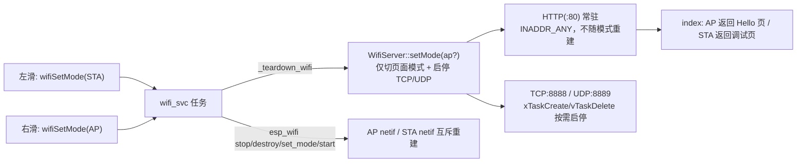

## 问题现象
烧录后（IDF v5.4.2 / esp32p4 / COM21），**第一次左滑进入第二屏即整机重启**。

串口日志关键证据：
```
[00:16:46.124] [wifi_svc] switch to STA mode
I (20560) wifi_server: udp server stopped
I (20560) wifi_server: tcp server stopped
Guru Meditation Error: Core 1 panic'ed (Stack protection fault).
Detected in task "prvTaskDeleteWi" at __retarget_lock_acquire_recursive   ← _vfprintf_r 调用链
Stack pointer: 0x4ff6a5c0 / Stack bounds: 0x4ff6a5d8 - 0x4ff6abd0           ← 栈仅 1528B，已越界
```
注意 `_stop_http()` 的收尾日志 `http server stopped` **从未打印** → 崩溃点精确落在 `httpd_stop()` 内部；且崩溃前无任何 `assert failed:` / `CORRUPT HEAP` 可读信息，说明 printf 尚未输出就把栈打爆。

## 已确认根因（非推测，逐条对照本机 IDF 源码）
1. `_stop_http()` → `httpd_stop()` → httpd 线程退出时调用 `httpd_os_thread_delete()`，其实现是 `vTaskDeleteWithCaps(xTaskGetCurrentTaskHandle())`（`esp_http_server/src/port/esp32/osal.h:38`）；httpd 线程本身由 `xTaskCreatePinnedToCoreWithCaps()` 创建。
2. `vTaskDeleteWithCaps()` 在**自删**场景下会创建临时任务 `prvTaskDeleteWithCapsTask`，而该任务只用 **`configMINIMAL_STACK_SIZE`** 创建（`freertos/esp_additions/idf_additions.c:168`）。IDF 中 `configMINIMAL_STACK_SIZE == CONFIG_FREERTOS_IDLE_TASK_STACKSIZE == 1536`，与日志中 1528B 的栈边界完全吻合（任务名被截断为 16 字符 `prvTaskDeleteWi`）。
3. 该临时任务内部路径含 `configASSERT(...)` 与 `heap_caps_free(puxStackBuffer)`（堆诊断会走 `printf`）。无论触发哪一个，newlib `_vfprintf_r` 都需 1KB+ 栈 → 1536B 栈必爆 → 硬件栈保护 panic。
4. 全工程仅 `esp_http_server` 一处使用 WithCaps 删除路径；`managed_components` 下第三方组件为 0 处。因此**唯一触发源就是 `httpd_stop()`**。

## 修复目标
- **彻底消除触发源**：HTTP 服务不再随 AP/STA 模式切换而 stop/start，改为进程内一次启动、常驻（其监听 socket 绑 `INADDR_ANY`，切网卡后无需重建即可继续服务）；TCP/UDP 仍按需启停。
- **让同类事故可诊断**：提升 IDF 内部清理任务/空闲任务的栈尺寸，使今后若再进该路径能打印出真实原因（`assert failed` 或 `CORRUPT HEAP`），而不是以栈溢出形式掩盖。
- **补齐周边隐患**：统一日志队列与历史记录的加锁顺序（消除潜在死锁）；扫描结果缓冲按实际上报数量分配（避免远端 RPC 不遵守入参上限造成越界写）。
- **回归验证**：AP↔STA 反复切换不重启；第一屏热点+网页、第二屏扫描/连接/超时、PC 侧网页与 TCP/UDP 双向收发全部正常。


## 技术栈（沿用现有，无新增依赖）
- ESP-IDF v5.4.2（`IDF_PATH=D:\.espressif\v5.4.2\esp-idf`）+ 目标 `esp32p4`，C++17；构建用 `C:\Espressif\tools\python\v5.4.2\venv` 与 `riscv32-esp-elf 14.2.0`。
- `esp_http_server`（8.2 行版 osal 使用 WithCaps 线程）、lwIP BSD socket、FreeRTOS；LVGL 8.4 + smooth_ui_toolkit（不改动 UI）。
- 新增源文件仍由 `main/CMakeLists.txt` 的 `GLOB_RECURSE` 自动收录，无需改 CMake。

## 实现方案

### 策略一：HTTP 服务常驻（核心修复，消除唯一触发源）
把服务生命周期从「随模式整体停启」改为「HTTP 常驻 + 数据通道按需」：
- `WifiServer::start(bool ap_mode)`：**始终**确保 HTTP 已启动（首次调用才 `httpd_start`，之后幂等返回）；仅更新页面模式标志 `_ap_mode`；`ap_mode==false` 时启 TCP/UDP，`ap_mode==true` 时停 TCP/UDP。
- `WifiServer::stop()`：**只停 TCP/UDP**，不再 stop HTTP。删除 `_stop_http()` 与对 `httpd_stop()` 的调用，从代码层面杜绝误用（这是本次崩溃的直接来源）。
- `WifiServer::setMode(bool ap_mode)`：新增，仅切换页面模式 + 启停数据通道，供模式切换直接调用。
- `_ap_mode` 改为 `std::atomic<bool>`，使首页在 AP/STA 之间即时切换而不重启服务（`index_get_handler` 逻辑不变，只是判据不再依赖重启）。
- 成立前提已核实：`httpd_server_init()` 监听 socket 绑 `INADDR_ANY`，与具体 netif 无关；`httpd_sess_close_all()` 只在停止时调用，切换时残留的 AP 侧连接会自然超时，可接受。
- TCP/UDP 子任务保持 `xTaskCreate()` 动态创建 + `vTaskDelete(nullptr)`：走 idle 任务回收路径，**不触发 WithCaps 临时任务**，原实现可沿用。

### 策略二：抬高 IDF 内部清理路径的栈（安全网 + 让错误可见）
`sdkconfig` / `sdkconfig.defaults` 中 `CONFIG_FREERTOS_IDLE_TASK_STACKSIZE`：`1536 → 4096`。
- IDF 将 `configMINIMAL_STACK_SIZE` 定义为该配置，因此 `prvTaskDeleteWithCapsTask` 同步获得 4096B；
- 同时空闲任务（同样执行 `prvDeleteTCB()` → `vPortFree` 堆诊断）也变安全；
- 代价：2 个空闲任务各 +2.5KB 常驻 RAM（本机 PSRAM 27MB + 内部 232KB，完全可承受）。

### 策略三：诊断可观测（把不透明崩溃变成可读报错）
在 `wifi_svc` 任务（6144B 栈，打印安全）中，服务启停前后各打一次：
`esp_get_free_heap_size()`、`heap_caps_get_free_size(MALLOC_CAP_INTERNAL)`、`heap_caps_get_largest_free_block(MALLOC_CAP_INTERNAL)`、`heap_caps_check_integrity_all(false)` 的返回值。
若原 printf 实为堆破坏报告，本次即可在日志中看到 `CORRUPT HEAP: ...` / `assert failed: ...` 的真实文本，从而进入下一轮定点修复（明确决策点，不做猜测性修改）。

### 策略四：周边硬化（顺手修掉两个真隐患）
1. **锁顺序统一**：`WifiServer::recordInbound()` 是 `_history_mutex → wifiNetData.mutex`；而 `WifiService` 的 `ClearLog` 命令处理是 `wifiNetData.mutex → _history_mutex`（反序，潜在死锁）。改为先在小作用域内清空 `rxQueue` 并释放，再调用 `clearHistory()`。
2. **扫描缓冲按真实数量分配**：`_fetch_scan_results()` 当前把 `records` 限制到 20 条，若远端 `esp_wifi_remote` 实现忽略入参上限、按从機返回条数拷贝，就会越界写。改为按 `esp_wifi_scan_get_ap_num()` 上报的 `count` 分配（并做上限保护），只在转成 UI 列表时截断展示条数——彻底不给越界留空间。

## 性能与可靠性
- 少一次 `httpd_start/stop`（省 ~8KB 栈 + 3 个 socket 的反复分配/释放），且切模式后网页立即可用，不再有 `THREAD_STOPPED` 轮询等待（`httpd_stop` 内 100ms 步进轮询）。
- `stop()` 语义变窄后，模式切换路径上的阻塞操作只剩 `close()` 与最多 300ms 的任务退出等待，仍全部在 `wifi_svc` 任务中执行，不阻塞 LVGL。
- 所有新增/修改代码不使用 `ESP_ERROR_CHECK`，保持既有 `ESP_RETURN_ON_ERROR + ESP_LOGx` 风格；诊断日志只在模式切换时输出，无常态刷屏。

## 架构（新的服务生命周期）


## 实现注意事项（执行细节）
- **只改服务生命周期，不动 UI/交互**：`app_main.cpp` 的滑动手势、`WifiStationView` 的控件与刷新逻辑保持不变。
- **不要保留可在运行期调用的 `httpd_stop()`**：直接删除 `_stop_http()` 及其调用，避免后续维护者误用再次踩坑；如确需彻底释放，只允许在进程退出路径使用。
- **`running()` 语义**：现在代表「HTTP 或数据通道任一在跑」，`WifiService::_refresh_services()` 中基于 `_services_up` 的判断需同步调整，避免因 HTTP 常驻导致 `stop()` 被反复调用。
- **`_ap_mode` 原子化**：`index_get_handler` 在 httpd 线程读、`wifi_svc` 任务写，必须用 `std::atomic<bool>` 或等效同步。
- **`CONFIG_FREERTOS_IDLE_TASK_STACKSIZE` 双写**：`sdkconfig`（生效）与 `sdkconfig.defaults`（团队默认值）都要改，否则下次 menuconfig 会回退。改完必须重新 `idf.py build`（该配置会写入 `build/config/sdkconfig.h`）。
- **日志规范**：沿用 `mclog::tagInfo` 与 `TAG "wifi" / "wifi_svc" / "wifi_server"`；诊断日志附带任务名/水位数值，不打印密码明文。
- **验证判据**：左滑进第二屏后日志应出现 `switch to STA mode` → `udp/tcp server stopped` →（**不再有 panic**）→ `local services started`；右滑回第一屏应看到 STA 断开 + 主页 `http://192.168.4.1` 恢复可访问。

## 目录结构（仅列受影响文件）
```
M5Tab5-UserDemo/platforms/tab5/
├── main/
│   ├── app_main.cpp                          # [不修改] 滑动手势与模式请求入口保持原样
│   └── hal/
│       └── components/
│           ├── wifi_server.h                 # [MODIFY] start()/stop() 语义收窄；新增 setMode(bool)；
│           │                                 #          _ap_mode 改 std::atomic<bool>；删除 _stop_http() 声明
│           ├── wifi_server.cpp               # [MODIFY] HTTP 一次启动常驻、不再 httpd_stop；
│           │                                 #          stop() 只停 TCP/UDP；首页按 _ap_mode 动态返回
│           └── wifi_service.cpp              # [MODIFY] _teardown_wifi/_refresh_services 改为
│                                             #          「切模式 + 启停数据通道」而非整体停启；
│                                             #          ClearLog 锁顺序修正；
│                                             #          _fetch_scan_results 按上报数量分配缓冲；
│                                             #          服务启停前后加堆完整性/栈水位诊断日志
├── sdkconfig                                 # [MODIFY] CONFIG_FREERTOS_IDLE_TASK_STACKSIZE=4096
└── sdkconfig.defaults                        # [MODIFY] 同上（团队默认值，防 menuconfig 回退）
```

## 关键代码结构（新的服务契约）
```cpp
/* wifi_server.h —— 生命周期契约（HTTP 常驻） */
/** @brief 确保 HTTP 已启动（幂等、一次启动后常驻）；切换页面模式并启停 TCP/UDP 数据通道 */
bool start(bool ap_mode);          // 仅首次真正 httpd_start
/** @brief 仅切换页面模式（AP=Hello 页 / STA=调试页）并启停 TCP/UDP，不触碰 HTTP */
void setMode(bool ap_mode);
/** @brief 仅停止 TCP/UDP 数据通道；HTTP 保持运行 */
void stop();
bool running();                    // HTTP 或数据通道任一在跑
bool ap_mode();                    // 首页分发判据（内部为 std::atomic<bool>）
```


## Agent Extensions
### SubAgent
- **code-explorer**
  - Purpose: 在改造 `WifiServer` 生命周期前，全仓枚举 `WifiServer::start/stop/running/ap_mode` 与 `httpd_stop` 的所有调用点，确保"HTTP 常驻"重构不漏改任何调用方（含 `wifi_service.cpp`、`app_main.cpp`、视图层）
  - Expected outcome: 得到完整且带文件行号的调用清单，据此确认 `stop()` 语义收窄后没有遗留的"期望 HTTP 一起停"的逻辑
### Skill
- **lsp-code-analysis**
  - Purpose: 校验修改后 `HalBase` 网络虚接口与 `HalEsp32` override 的签名一致性，并确认 `WifiService::_teardown_wifi/_refresh_services` 的引用关系与符号解析无遗漏
  - Expected outcome: 类型/签名引用分析报告，确认无未实现接口、无悬挂引用（比纯文本搜索更可靠）
